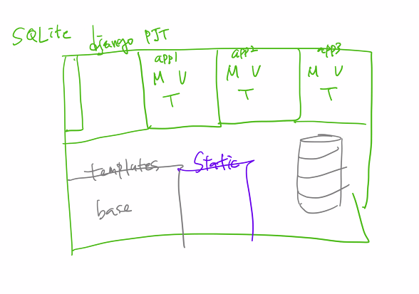
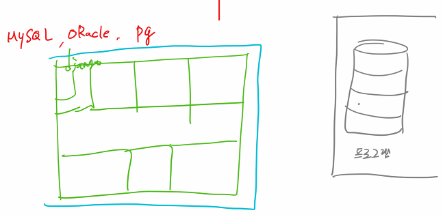

# Django

파이썬 웹 프레임워크

- MTV 패턴

HTTP(Request)  => URLS(urls.py) => View(views.py) <= Template(<filename>.html) 

​                                                                          ^

​                                                             Model(models.py)  


## 기초 내용

#### 가상환경

```shell
$ python -m venv venv
```

```shell
$ source venv/Script/activate
```


### 설치

```python
$ pip install django==2.1.15
```


#### gitignore

- .git이 있는 위치에서 실행

```shell
$ touch gitignore
```


## Django 프로젝트 시작

#### 프로젝트 생성

```python
$ django-admin startproject {프로젝트명}
```

#### 서버 실행

- django_intro 폴더의 settings.py 파일에 아래와 같이 수정한다.

  ```python
  # line 28
  ALLOWED_HOSTS = ['*']  # 와일드 카드
  ```

- 반드시 서버 실행시 명령어가 실행되는 디렉토리를 확인할 것

  보통 프로젝트 폴더에서 시작되며, 마스터 앱과 프로젝트를 구분지어 주기 위하여 프로젝트 폴더 이름을 대문자로 rename한다.

  ```python
  ~/INTRO/ $ python manage.py runserver 8080
  ```

- 서버 종료는 터미널에서 ctrl + c 함께 입력한다.

  

## App 생성

```python
$ python manage.py startapp {앱 명}
```


### App 등록(settings.py)

```python
INSTALLED_APPS[]에 만든 App을 추가 등록 ex) 'pages'
```


# Model

- model(ing) 은 현실세계의 무언가를 컴퓨터로 옮기기 위해 하는 일, MTV 패턴에서 데이터를 관리

- IT와 ICT가 유망해진 이유는 'Data(All about Data)'가 각광받기 때문이다.

  - 어떤 데이터를 어떻게 제공할 것인가? ex) google은 검색 데이터를 보여준다, airbnb는 숙박 데이터를 web/ app에 보여준다.
  - Data를 효과적으로 탐색/정렬 하기 위해서 Algorism을 배우고 있다.
  - Data를 가장 쉽게 다수에게 제공하기 위해서 Web을 배우고 있다.
  - 서버는 Data를 제공과 처리가 목적이다.

- where? Data는 Database에 있다.

  - Database는 프로그램이다. 그렇기에 명령 및 조작을 해야한다.
    - 프로그램을 조작하는 언어 = SQL (Structed Query Language)
    - Database가 하는 일은 크게 4가지가 있다 : Create, Read(Retrieve), Update, Delete => CRUD operation

- Django

  - Request로 들어온 Data를 저장할 곳이 필요하다. => Database
  - 표(table)에 속성값과 col를 정해주는 작업이 Schema(스키마)
  - 사용자가 보내는 Data를 검증하는 작업을 해줘야 한다. 왜냐면 제 각각으로 입력을 하기 때문이다. 그렇기에 제약조건(속성)을 걸어야한다. ex) 빅데이터의 GIGO(Garbage In Garbage Out)
    - 짧은 문자열 (CharField) : max_length라는 조건을 꼭 줘야한다.
    - 긴 문자열 (TextField) 
    - 숫자(정수) (IntegerField)
    - 날짜 (DateTimeField)

  - Table에는 Unique, Primary, Identity한 key가 필요하다.  ex) id, 주민등록번호, 사원번호

  - Django와 Database는 다른 세계이다. 그렇기 때문에 중간에 중계자가 필요하다.

    => Python으로 명령을 하면 Database에 접근하게 가능하게 도와주는 것이 ORM.

  - ORM : Object Relation Mapper ( Python은 oop(객체지향언어), RDBMS(관계형데이터베이스)의 앞글자인 Object와 Relation을 따서 연동시켜주는 것) , 데이터베이스를 조작
  
- 그 중에 우리는 Django에서 제공하는 ORM을 사용
    - ORM은 Instance를 save하면 자동으로 SQL을 실행한다.
    
  - 마이그레이션(Migration) - 모델의 변경사항들을 데이터베이스 스키마에 반영하는 방법, Model로 정의된 데이터베이스 스키마를 반영
  
    

## GET과 POST

 URL이 길어질 경우에 method='POST'로 넘겨준다.

우리는 DB가 변경되는 요청은 POST로 한다. (C, U, D)

그게 아니라면 GET (R) - 실질적으로 90%

- GET - R (Get/articles) => 목록, (Get/articles/1) => 1번 내놔
- POST - C (Post/articles) => 생성
- PUT/PATCH - U (Patch/articles/1) => 1번 수정
- DELETE - D (Delete/articles/1) => 1번 삭제

 그러나 Django에는 GET/POST만 존재한다.

*** GET은 HTML를 보여줄 때 사용을 하며, POST는 데이터의 변환이 있을 때 사용을 한다.


GET 방식으로 게시물이 삭제되는 것을 방지하는 방법

```PYTHON
from django.views.decorators.http import require_POST  # views.py에 추가

@require_POST  # fancy하게 GET방식으로 DELETE되게 하는 것을 방지하는 방법
def delete(request, pk):
    article = get_object_or_404(Article, pk=pk)
    article.delete()
return redirect('articles:index')
```


### static 파일 관리

 앱별로 관리를 하고 싶다면 static폴더를 만들고 그 안에 templates와 같이 앱이름의 폴더를 만들어주고 그 안에 이미지와 같은 파일을 넣어준다. 


- 파일이나 이미지를 같이 넘겨주기 위해서는

  - `enctype="multipart/form-data"`을 추가적으로 작성해주어야한다.

    ```HTML
    <form action="" method="POST" enctype="multipart/form-data">
        
        
    </form>
    ```

    

  - views함수 내에서 form = ArticleForm(request.POST, request.FILES) 처럼

    `request.FILES`도 같이 넘겨주어야한다.

  - settings.py에서 MEDIA_ROOT와 MEDIA_URL를 추가해준다.

    ```PYTHON
    # 미디어 파일을 저장하기 위한 루트 경로
    MEDIA_ROOT = os.path.join(BASE_DIR, 'media')
    MEDIA_URL = '/media/'
    ```

  - 마스터앱의 urls.py 에서 static과 settings을 import에 추가하고 urlpatterns에도 작성해준다.

    ```python
    from django.conf import settings
    from django.conrib.urls.static import static import static
    
    urlpatterns = [
        path('admin/', admin.site.urls),
        path('articles', include('accounts.urls'))
    ] + static(settings.MEDIA_URL, document_root=settings.MEDIA_ROOT)
    ```

  

- 이미지를 잘라서 저장하기 위해서는 pilkit과 django-imagekit을 설치한다.

  ```shell
  $ pip install pilkit django-imagekit
  ```

  이 후에 django document에 있는대로 models.py에 가서 복사 붙여넣기를 하여 사용

  - ResizeToFill : 300 * 300 자르는 것(crop)
  - ResizeToFit : 가장 긴 곳(너비/높이)을 300으로 맞추고, 비율에 맞춰서


 

## admin.py

```python
from .models import Article  # 추가

# 선택
class ArticleAdmin(admin.ModelAdmin):

	list_display = ('id', 'title', 'content', 'created_at', 'updated_at',)

# 등록
admin.site.register(Article)
```


 위와 같이 admin.py에 선택적으로 추가를 해주면 admin 페이지에서 해당 table을 대시보드와 같이 보기 좋게 나타난다.


## forms.py

```python
from django import forms

class ArticleForm(forms.form):
    title = forms.CharField(max_length=30)  # 여기서 max_length는 선택
    content = forms.CharField(widget=forms.Textarea)
    
```


 forms.py 에서 정의해준 ArticleForm을 views.py에서 models와 비슷하게 사용가능하다.

그러나 models.py에서 정의해준 것과 forms.py에서 정의하는 것이 중복되는 현상이 발생한다.

이러한 불편한 사항을 해결하는 방법이 다음과 같다.


```python
from django import forms
from .models import Article

class ArticleForm(forms.ModelForm):
	class Meta:
		model = Article
        fields = ['title', 'content']  # 사용할 field
```


### Article의 해당 인스턴스를 쉽게 넘기는 방법

```python
def update(request, pk):
    if request.method == 'POST':
        form = ArticleForm(request.POST, instance=article)
        # instatnce=article를 위에서 작성하지 않으면 그저 생성하는 작업이기 때문에 수정			하기 위해서는 작성을 해야한다.
        if form.is_vaild():
            article = form.save()
            return redirect('articles:detail', article.pk)
    else:    
        article = get_object_or_404(Article, pk=pk)
        # 수정시에는 해당 article 인스턴스를 넘겨줘야한다!
        form = ArticleForm(instance=article)
    context = {
        'form' : form
    }
    return render(request, 'articles/update.html', context)
```


### 유효성 검사

 form에서 is_vaild=unknown인 상태에서 save() 하면 error를 발생시킨다.

대신 is_vaild=False이면 error가 아닌 저장을 안 시킨다.

```python
def new_article(request):
    if request.method == 'POST':
        form = ArticleForm(request.POST)  # request.POST가 유사 딕셔너리 형태이기 												때문에 전체 데이터가 다 넘어온다.
        if form.is_vaild():
            form.save()
            return redirect('articles:article_detail', article.id)
        else:
            return render(request, 'articles/new_article.html', {'form':
                                                                form,
                                                                })
```


```html
  # 해당 url 이름으로 분기
	<h2>새 글쓰기</h2>

	<h2>수정하기</h2>

<form>
     # crate와 update에 동일하게 적용되는 코드 작성
</form>        
```


# 사용자 인증관리

Django에서는 기본적인 User objects를 제공하고 있다.


- User objects
  - username
  - password
  - email
  - first_name
  - last_name


- 비밀번호 제공 및 확인
  - UserCreationForm 추가 column정의
  - 저장 로직에서 일치하는지 확인

- 비밀번호 암호화 저장
  - User.objects.create_user(username,emil=None, password=None)
  - user.set_password(password)


### 로그인

웹 = Http

Request & Response

- Http 2가지 특성
  - Statelss - 상태가 없음
  - Connectless - 연결이 없음


User <= Abstract User <= (username, 성/ 이름/ 이메일/ 기타) Abstract Base User <= (password/ last login/ is_active) models.Model 상속

비밀번호 + a를 하고 싶으면 Abstract Base User를 사용 class MyUser(Abstract Base User)


- 로그인 form

```python
from django.contrib.auth.forms import AuthenticationForm
```


# 데이터베이스

RDBMS : MySQL, Oracle, SQLite

NOSQL : MongoDB, Casandra, Redis

- SQLite : 유일하게 내부에 있는 파일형태

  

- MySQL, Oracle, pg : 따로 프로그램 형태 (연동이 필요하다.)



- 데이터베이스 장단점
  - 장점 : 데이터 중복 최소화, 데이터 공유, 일관성, 무결성, 보안성 유지, 데이터의 표준화 가능, 용이한 데이터 접근
  - 단점 : 전문가 필요, 비용 부담, 백업과 복구가 어려움, 시스템 복잡함, 과부하 발생


- 데이터 무결성 (Data Integrity)
  - 컴퓨팅 분야에서 데이터의 정홗어과 일관성을 유지하고 보증하는 것
  - 유형 
    - 개체 무결성 : 모든 테이블이 기본키를 가져야 하며, 고유하며 빈 값은 허용되지 않는다.
    - 참조 무결성 : 모든 외래키 값은 참조 릴레이션의 기본키거나 NULL
    - 도메인 무결성 : 정의된 도메인에서 모든 열(속성)이 선언되도록 규정


### 1:N


```python
# 1
class Reporter(modles.Model):
    username = models.CharField(max_length=10)
    
# N
class Article(models.Model):
    title = models.CharField(max_length=10)
    content = models.TextField()
    reporter = models.ForeignKey(Reporter, on_delete=models.CASCADE)
    
```

- `article_article` 체이블에 reporter_id 컬럼이 추가 된다.
- `reporter`의 경우 article_set으로 N개(QuerySet)를 가져올 수 있다.
- article의 경우 reporter로 1에 해당하는 오브젝트를 가져올 수 있다.
-  on_delete :=
  - CASCADE : 해당 객체('reporter')가 삭제 되었을 때 참조하는 객체(article)도 모두 삭제
  - PROTECT : 참조하는 객체(article)가 존재하면, 삭제(reporter) 금지.
  - SET_NULL : NULL값으로 치환, NOT NULL 옵션이 있는 경우는 활용 할 수 없음
  - SET_DEFAULT : 디폴트 값(article)을 참조하게끔 한다.


### M : N (Many to Many)

```python
class Doctor(models.Model):
    name = models.CharField(max_length=10)
    
class Patient(models.Model):
    name = models.CarField(max_length=10)
    # M:N 필드! reservation 통해서, Doctor
    doctors = models.ManyToManyField(Doctor, through='Reservation',
                                    related_name = 'patients')
    
class Reservation(models.Model):
    doctor = models.ForeignKey(Doctor, on_delete=models.CASCADE)
    patient = models.ForeignKey(Patient, on_delete=models.CASCADE)
```

#### 문제

1. d1의 환자

   ```python
   for reservation in d1.reservation_set.all():
       print(reservation.patient.name)    
   ```

   ```python
   p1.doctors.all()
   ```


- `related_name` : 역참조 옵션
  - 기본 값은 `{model 이름}_set`
  - 


 

 ### PROFILE 꾸미기

- Gravatar : 블로그에 글을 쓰거나 댓글을 쓰는 것 같은 일을 할 때 이름 옆에 나타나서 사이트마다 당신을 따라다니는 그림

- 활용방법

  - Gravatar API는 인증이 필요하지 않습니다. HTTP GET 요청 하나로 모든것을 처리 할 수 있다.

  ```SHELL
  email = 'duseh73@gmail.com'
  email_space = '  DusEh73@gamil.com  '
  # 앞 뒤 공백을 제거해주어야 한다.
  email_space.strip()
  # 대문자를 소문자로 변환해주어야 한다.
  email_space.lower()
  # MD5 Hash Generator로 변환해준 값을 결과로 받는다.
  # 최종적으로 다음과 같이 작성한다.
  hashlib.md5(email.encode('utf-8').strip().lower()).hexdigest()
  ```

  이 후에 views.py에서 추가해주고 사용할 template에 views.py에서 추가해준 변수를 활용할 수 있도록 작성해준다.

  - 모든 템플릿에서 활용을 하기 위해서 다음과 같은 작업을 시행한다.

    ```python
    # templatetags 폴더를 만들어준다.
    # templatetags 폴더 안에 __init__.py와 gravatar.py를 만들어주고
    # gravatar.py
    import hashlib
    from django import template
    from django.template.defaultfilters import stringfilter
    
    register = template.Library()
    
    @register.filter
    @stringfilter
    def profile_url(email):
        return hashlib.md5(email.encode('utf-8').strip().lower()).hexdigest()
    
    # 사용할 템플릿에서
    
    {{ request.user.email|profile_url }}
    
    #=====================================================================
    
    # 아니면 models.py에서 @property를 활용한다.
    def User(AbstractUser):
        # model작업을 한다.
        
        @property
        def gravatar_url(self):
            return f"https://s.gravatar.com/avatar/{hashlib.md5(email.encode('utf-8').strip().lower()).hexdigest()}
        
    # 이 후에 사용할 template에 다음과 같이 작성해준다.
    
    ```

    

