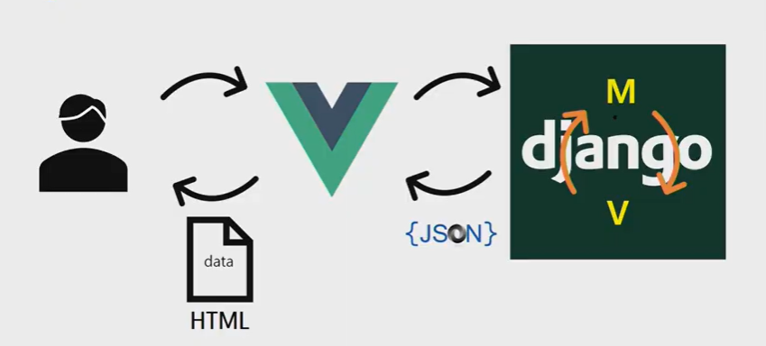

# JSON

JavaScript Object Notation

- why JSON?
  - XML보다 짧기 때문에 경제적인 이윤과도 연결된다.


Django에서 JSON형식에 맞춰서 Data만 제공하는 것이 목표




### faker

데이터를 하나하나 타이핑하는것이 아니라 자동화로 좀 더 유용하게 하는 방법

```shell
$ pip install faker
```


### Serializers

##### data 검증, data 변환을 해주는 역할


```python
class Artist(models.Model):
    name = models.CharField(max_length=100)
    
    @classmethod
    def dummy(cls, n):
        cls.objects.bulk_create([
            cls(name=f.name() for _ in range(n))
        ])
        
class Music(models.Model):
    artist = models.ForeignKey(Artist, on_delete=models.CASCADE)
    title = models.CharField(max_length=500)
    
    @classmethod
    def dummy(cls, n):
        for artist in Artist.objects.values('id'):
            cls.objects.bulk_create([
            cls(artist_id = artist_id['id'], title=f.text(10)) for _ in range(n)
        ])
```


### REST

REST API

URL : 자원의 위치 표시

RESTful하게 짜여져있다.

- http verb : GET, POST, PUT/PATCH, DELETE
- 명사(복수형) : articles

